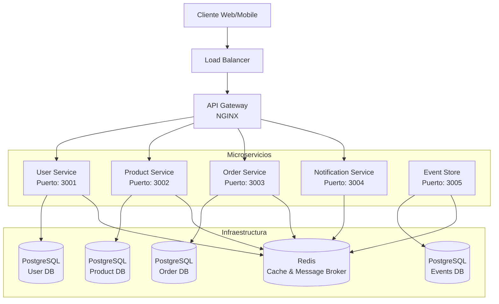
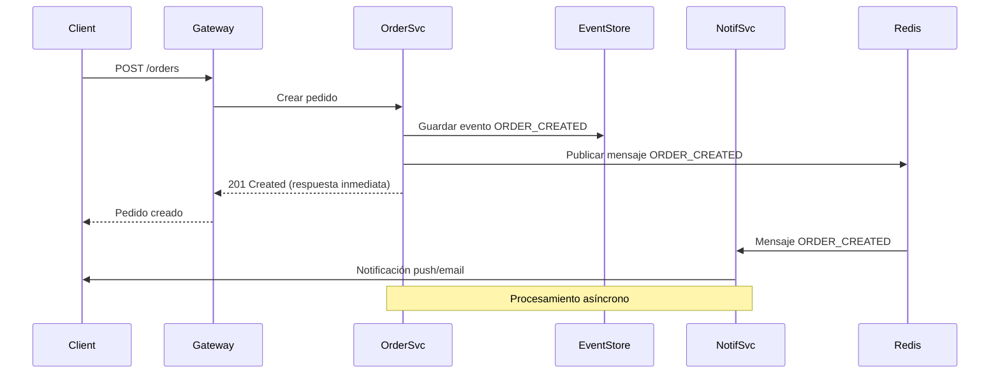
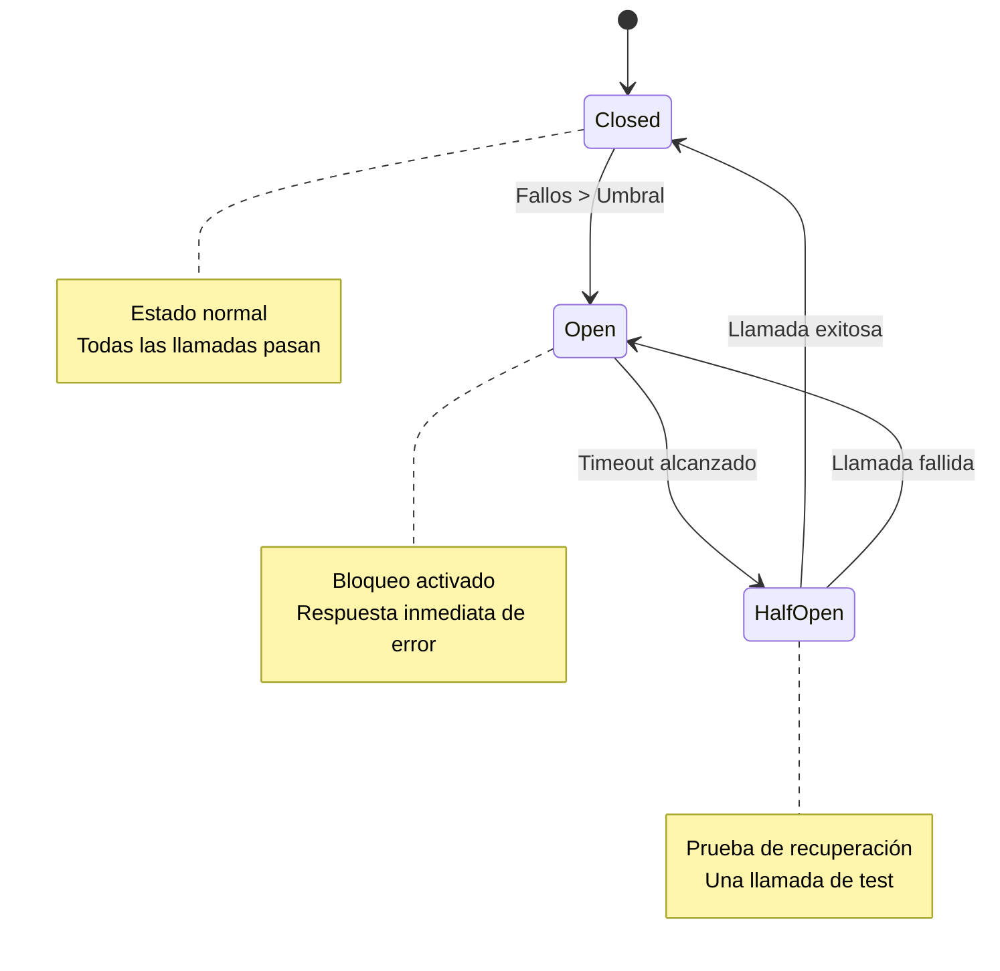
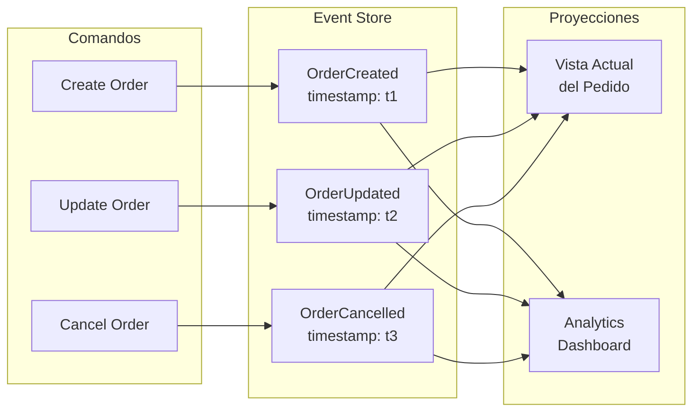
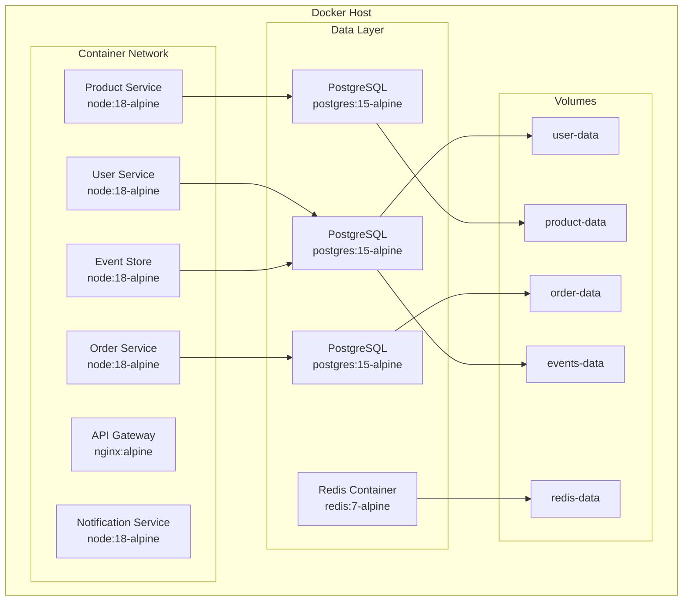
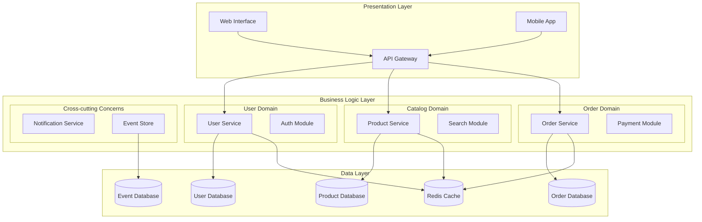

# Diagramas Arquitectónicos - CloudMarket

## 1. Arquitectura General del Sistema

## 2. Patrón de Comunicación Asíncrona

## 3. Patrón Circuit Breaker

## 4. Event Sourcing Pattern

## 5. Patrón de Contenedores

## 6. Separación de Responsabilidades

